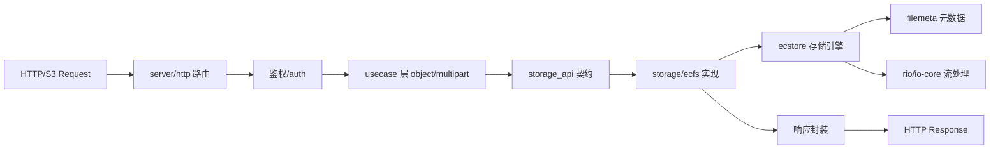

# RustFS 源码精读（sourceReader）

> 目标：从可运行系统视角阅读 RustFS 的源码结构，形成一份“能看懂、能追踪调用、能定位风险点”的阅读文档。

## 1. 项目定位与模块边界

RustFS 是一个用 Rust 实现的分布式对象存储系统，代码组织上是“**主服务二进制 + 多个共享库 crate**”的典型形态：

- `rustfs`：主服务入口与运行时编排。
- `crates/ecstore`：分布式对象数据平面/控制平面的核心存储内核。
- `crates/storage-api`：对外统一的存储接口和错误模型。
- `crates/filemeta`：对象元数据与版本化 metadata 结构（`xl.meta` 相关）。
- `crates/io-core`、`crates/rio`：I/O 抽象与流式读写工具链。
- `crates/admin` / `admin` 相关：管理 API 与运行期治理能力。

它的设计可以用一句话概括：

- 上层是 S3/API Server 与启动/生命周期控制；
- 中间是统一的 `StorageApi` 与对象应用用例；
- 最底层是 `ecstore` 持久层与文件元数据模型。

## 2. 启动链路（主线程视角）

主入口集中在 `rustfs/src/main.rs`：

1. 初始化 tracing/logging。
2. 读取 `App` 配置与启动参数。
3. 调用 `startup_entrypoint::run_process`。

`startup_entrypoint` 负责整体启动“生命周期护栏”与信号处理，核心动作是：

- 组装 `startup_config` 与环境变量映射；
- 进入统一启动流程 `startup_server`；
- 注册关闭/退出回调；
- 将 runtime 运行后交由生命周期任务等待关闭信号。

`startup_server` 进一步拆为一组“阶段化初始化”：

- `startup_runtime`：全局运行时对象与 task runtime 初始化。
- `startup_storage`：初始化对象存储内核。
- `startup_services`：HTTP、RPC/管理端服务装配。
- `startup_protocols`：路由/中间件/协议适配。
- `startup_lifecycle`：运行态生命周期钩子（启动、停止、状态回报）。

### 2.1 观察点

- 启动顺序固定，`storage` 与 `services` 解耦，但生命周期统一受控。
- 任何一个初始化阶段若失败，主流程会返回 `Err` 并终止启动。
- 关闭链路对资源回收有显式路径：服务关闭、任务取消、后台任务退出。

## 3. 服务端与 HTTP/S3 入口

`rustfs/src/server/http.rs` 是 S3 与管理 API 对外暴露的核心路由层。

### 3.1 路由层职责

- 构建 Hyper/Tower 路由树。
- 注入通用中间件（如鉴权、限流、请求上下文、trace/request-id）。
- 按模块挂载 S3 API 以及管理 API。
- 对不同路径与方法做统一错误转译。

### 3.2 请求到达到核心逻辑的典型路径

`HTTP 请求` -> `路由命中` -> `鉴权/上下文构造` -> `storage/s3_api` 中对应模块（bucket/object/multipart）->`app 用例（usecase）`->`storage_api trait/接口`->`ecfs` 实现->`ecstore` 底层。

这个路径说明一个关键特征：

- HTTP 只是“边界适配器”；
- 真正对象语义在 `usecase` + `storage-api` 层定义；
- 持久化能力落在 `ecstore`。

## 4. `Storage API` 与用例层

`rustfs/src/storage_api.rs` 以及 `crates/storage-api` 共同定义了对象存储的契约。

### 4.1 为什么有这一层

- 兼容不同后端实现（当前核心是 ecstore）。
- 在服务层和底层引擎之间形成稳定边界。
- 错误语义、请求参数与返回对象通过类型明确化。

### 4.2 用例（Usecase）

`object_usecase.rs` 和 `multipart_usecase.rs` 将路由层命令转成“可组合操作”：

- 校验对象参数合法性；
- 拼接 bucket / object / version 语义；
- 调用 storage API；
- 对返回值进行 HTTP 级封装。

这层相当于“业务语义门面”：既不直接拼 SQL/IO，也不做具体对象布局。

## 5. `ecstore` 初始化链路（最关键）

核心存储初始化发生在 `rustfs/src/startup_storage.rs` 与 `rustfs/src/init.rs`，再下沉到 `crates/ecstore/src/store/init*.rs`。

主要步骤如下：

1. 读取 `storage` 相关配置：数据盘、卷（pool）参数、格式版本与兼容策略。
2. 调度 `store::init`：
   - `check_remote_storage`：对远程卷/节点进行预检。
   - 连接本地池，加载/识别 format 元数据。
   - 检查 `format.json` 与运行版本兼容性。
3. 首次启动路径：若检测到未初始化/格式缺失，进入 format 初始化流程。
4. 非首次启动路径：尝试恢复格式，进行 migration 或校验。
5. 恢复 decommission 状态（如果存在下线节点重建/修复上下文）。
6. 加载/重建内存中的池元数据（包括 bucket 元信息、位点与策略）。

### 5.1 与 `init_format` 的关系

`init_format.rs` 负责对磁盘上的版本与布局元信息做一致性处理：

- 新旧 layout 的兼容路径；
- 关键元信息缺失时的兜底；
- 关键版本边界与日志告警。

### 5.2 风险点（读代码时值得盯）

- 多盘初始化时并发状态一致性：池初始化顺序与错误回滚策略。
- `format` 兼容路径是否会在异常中留下半初始化状态。
- Decommission 信息恢复时，版本比较与幂等是否严格。

## 6. `storage/ecfs.rs` 与 S3 Trait 的对齐

`rustfs/src/storage/ecfs.rs` 是将 `storage_api` 上层接口映射到 `ecstore` 的主要落点。

- 通过 `s3s::S3` trait 实现 S3 兼容对象操作；
- 对应 `storage/s3_api` 的模块调用；
- 对外行为约束：错误码、etag/版本语义、multipart 生命周期。

读起来最值得注意的是：

- 不同对象操作对错误语义的一致处理是否同构（尤其删除、HEAD、GET 的 404/412 场景）；
- list / multipart / copy 的版本语义边界；
- 头部元数据的兼容键写入是否同时兼容 RustFS/MinIO 约定。

## 7. 元数据模型：`filemeta`、`fileinfo`

`crates/filemeta` 是对象元数据世界的“真理源”：

- `filemeta.rs`：读写 xl-like 结构及其版本头排序。
- `fileinfo.rs`：对象版本信息、块分布、校验和（checksum/etag）等元数据类型。

### 7.1 关键思想

- 采用版本化元数据容器：避免单字段升级损坏。
- 在目录/对象元信息路径上保持可回放语义。
- 上下游约定通过 helper 封装，防止裸字符串 key 分散使用。

### 7.2 与服务层的对齐

路由/用例层只描述“要做什么”，元数据层定义“对象是否有效、在哪个版本、校验如何匹配”。因此元数据层越稳，API 语义越不漂移。

## 8. IO 与对象流（`rio` / `io-core`）

`crates/rio` 与 `crates/io-core` 共同处理对象流的读写。`reader`、`writer` 抽象把对象读写拆成可重用组件。

- 负责底层缓冲策略。
- 支持 hash/eTag 计算、可能的解码/转换适配；
- 与上层存储对象生命周期配合：上传、拷贝、重试和拼装。

这类路径是高频路径，实际读写对象时需关注：

- 是否在关键路径产生不必要 clone；
- buffer 生命周期是否与异步任务解绑；
- checksum 失败后的重试边界和短读处理。

## 9. 身份与鉴权

`rustfs/src/auth.rs` 提供鉴权前置：

- 解析请求凭据；
- 生成上下文身份；
- 与访问控制策略联动。

鉴权不是单点入口，而是贯穿路由层与对象层的串行断言：未通过即快速拒绝，不进入对象执行路径。

## 10. Admin 与运维接口

`rustfs/src/admin` 与相关启动阶段把运维 API 映射进运行时：

- 节点元信息读取；
- 生命周期操作；
- 监控与状态观察能力（与运行态生命周期管理协作）。

其定位是“可观测 + 可治理”，与对象读写区分清楚：

- 对象 API 强调幂等与一致性；
- Admin API 强调可恢复性和可诊断性。

## 11. 上下文与运行时依赖注入

`rustfs/src/app/context.rs` + `startup_runtime_sources.rs` 组成了上下文模型：

- 全局静态项 + server scope slot。
- 通过生命周期对象提供可替换的运行时依赖（便于测试/embedded 场景）；
- 避免将全局单例直接固化在各模块中。

这能解释 RustFS 在“单进程启动”和“多服务嵌入”场景如何复用同一套组件。

## 12. 配置流与可观测性约定

`rustfs/src/config/mod.rs` 定义配置入口与 env 注入策略，贯穿启动前后：

- 配置聚合：文件/环境变量/默认值。
- 对关键配置做结构化校验；
- 启动日志输出用于问题定位（注意：避免日志泄露敏感字段）。

日志/追踪风格上，代码中大量使用 `tracing` + 结构化字段。

## 13. 一次完整对象请求的“可视化追踪”

## 14. 设计取舍与后续可读性建议

1. **职责分层清晰**：路由/鉴权/用例/存储/元数据分层明确。
2. **初始化阶段集中化**：大量资源在启动时统一初始化，运行中对象路径相对稳定。
3. **复用率高**：`storage_api` + `filemeta` 与 `io` 公共层增强组件一致性。
4. **继续深入建议**：
   - 深读 `crates/ecstore/src/object` 目录的对象生命周期主逻辑；
   - 深读 `crates/storage-api/src` 的边界错误映射；
   - 深读 `admin` 子系统的鉴权回放路径。

## 15. 结论（简明版）

RustFS 的源码结构非常偏“平台化分层”思路：启动态以生命周期控制为骨干，HTTP 层只做协议适配，不把对象语义混入 transport；对象语义在 `storage_api/usecase/s3_api` 形成稳定收敛，再由 `ecstore` 与 `filemeta` 落盘保证一致性。若做问题定位，优先沿“请求追踪链路”从 HTTP 到 `filemeta` 回溯，最快确定行为边界。

## 16. 目录补充：关键文件的“行为标签”速查

以下按职责分组给出“在读代码时最值得卡住的行为点”：

### A. 启动主线

- `rustfs/src/main.rs`
  - 入口职责：初始化日志/配置并调用 `run_process`。
  - 重点看：错误传播是否有分支降级；启动参数是否在入口集中校验。

- `rustfs/src/startup_entrypoint.rs`
  - 入口编排器：统一处理 `run`/`graceful_shutdown` 流程。
  - 重点看：退出码和错误类型在最外层的最终呈现。

- `rustfs/src/startup_server.rs`
  - 启动总装配：把 runtime、storage、protocols、services、lifecycle 串成一条可重入链。
  - 重点看：各阶段之间的错误边界（例如 storage 成功后 service 失败要回滚哪些对象）。

- `rustfs/src/startup_*` 全景
  - `startup_runtime.rs`：运行时资源池与异步执行上下文。
  - `startup_runtime_sources.rs`：runtime 依赖源构造（embedded 场景下尤为关键）。
  - `startup_storage.rs`：调用 `init`，并组装 `StorageApi` 实例。
  - `startup_services.rs`：服务对象创建（HTTP 监听/管理服务）。
  - `startup_protocols.rs`：API 协议插件化入口。
  - `startup_lifecycle.rs`：启动/停止钩子。
  - `startup_shutdown.rs`：优雅退出流程。

### B. HTTP、S3、Admin 一次请求路径

- `rustfs/src/server/http.rs`
  - 关注：是否存在重复匹配路由、Method 分派是否覆盖异常。
  - 关注：中间件顺序（鉴权前/后，是否影响可观测性上下文）。

- `rustfs/src/storage/s3_api/*`
  - `bucket.rs`：桶级别操作（建桶、删除桶、策略/ACL-like 行为）。
  - `mod.rs`：S3 API 模块总线，多个 handler 的组织方式。
  - `object.rs`：对象 CRUD 核心。
  - `multipart` 目录：分片初始化/上传/完成。

- `rustfs/src/admin/mod.rs`
  - 管理 API 的统一入口，通常和 object 请求共享部分上下文但具备独立鉴权粒度。

### C. 业务用例层（Usecase）

- `rustfs/src/app/object_usecase.rs`
  - 路由语义 -> storage 调用的转换层。
  - 重点看：请求合法性、元数据透传、返回码映射。

- `rustfs/src/app/multipart_usecase.rs`
  - 多段上传状态机在业务层如何表达：初始化、上传、完成、清理。
  - 重点看：边界状态（悬挂 upload、并发完成）是否被明确定义。

### D. 存储契约与实现

- `rustfs/src/storage_api.rs`
  - 对 `storage-api` 的“服务端胶水”；是否在这个层把错误统一。

- `crates/storage-api/src/lib.rs`
  - 对外 trait 与统一错误。

- `crates/storage-api/src/object.rs`
  - 对象级方法签名，决定上层可观察行为。

- `crates/storage-api/src/error.rs`
  - 错误分类决定最终 HTTP 返回码映射路径。

- `rustfs/src/storage/mod.rs`
  - storage factory / 装配入口。

- `rustfs/src/storage/ecfs.rs`
  - S3 trait 的实现层。
  - 重点看：与 `storage_api` 的行为一致性（是否将同类异常统一到同类返回码）。

### E. 核心持久层 `ecstore`

- `crates/ecstore/src/lib.rs`
  - 顶层导出/模块组织，方便快速判断外部可见 API。

- `crates/ecstore/src/store/init.rs`
  - 初始化主流程。
  - 关注格式识别、兼容性分支、decommission 恢复。

- `crates/ecstore/src/store/init_format.rs`
  - format 的升级与创建策略。

- `crates/ecstore/src/core/pools.rs`
  - 池子元数据管理，涉及资源回收与并发安全。

### F. 元数据层

- `crates/filemeta/src/lib.rs`
  - 对 `filemeta` 的统一 re-export 与对外入口。
- `crates/filemeta/src/filemeta.rs`
  - 元数据版本、读写入口。
- `crates/filemeta/src/fileinfo.rs`
  - 文件信息结构与校验、版本标识。

### G. IO 与流式处理

- `crates/rio/src/lib.rs` / `reader.rs` / `writer.rs`
  - 对象流对象化处理；
  - 建议读“缓冲 + 校验”是否在同一次流中完成。

- `crates/io-core/src/lib.rs` / `writer.rs`
  - 更底层 IO 抽象。

---

## 17. 再进一步的阅读建议（按“少看文件，多见路径”）

如果你希望后续我再“继续精读”，建议按这个顺序补：

1. 先把 `rustfs/src/storage/ecfs.rs` 读完整到 multipart 与 delete/full object branch 收口。
2. 再读 `crates/ecstore/src/object` 下对象操作核心（put/get/delete/multipart commit）。
3. 最后读 `crates/filemeta/src/filemeta.rs` 的 decode/encode 边界。

每一步都对应一个“上层调用 -> 下层落盘”闭环，能快速定位：

- 这个行为为何返回 404/403/409；
- 何时产生分片残留；
- 哪个字段导致跨版本兼容失败。

## 18. 你可以直接复用的检索模板（高价值命令）

- 按 symbol 查改动点：
  - `rg -n "pub async fn|get\(|put\(|delete\(|complete_multipart|initiate_multipart" rustfs/src crates -g '*.rs'`

- 按错误码链路查来源：
  - `rg -n "ErrorKind::|StorageError|S3|NoSuchKey|AccessDenied|PreconditionFailed" rustfs/src crates -g '*.rs'`

- 按元数据键查跨层一致性：
  - `rg -n "x-rustfs-internal-|x-minio-internal-" rustfs/src crates -g '*.rs'`
